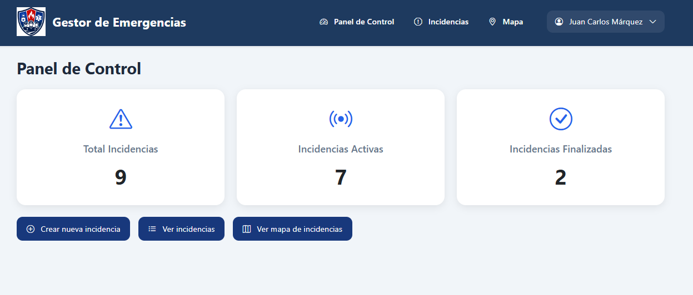
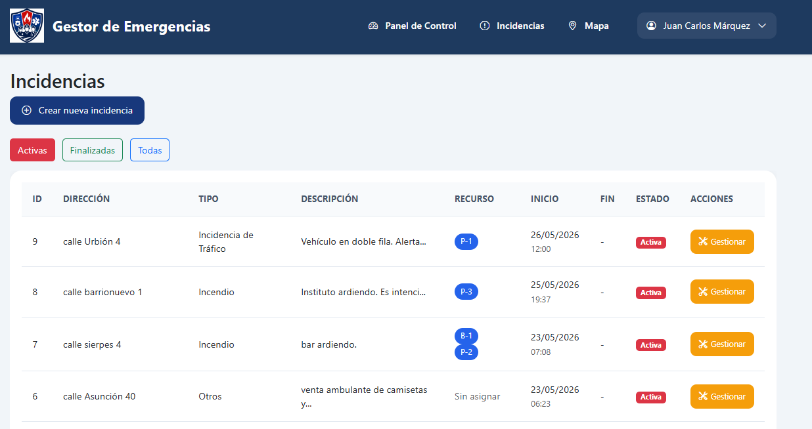
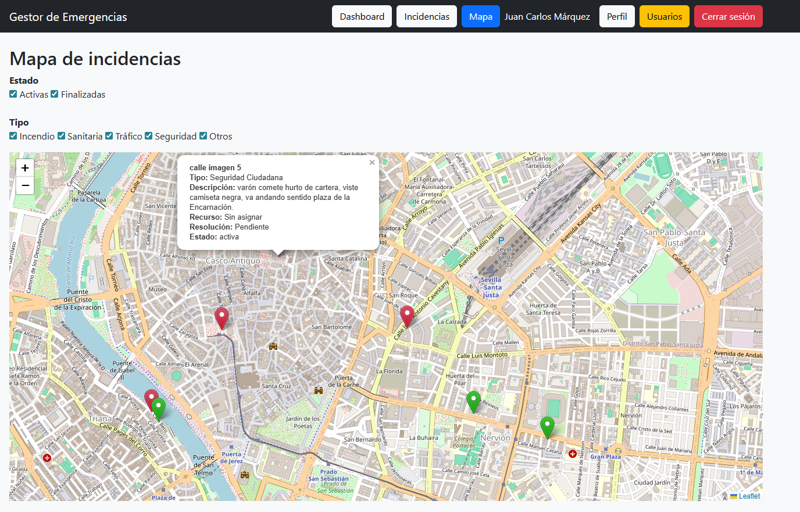
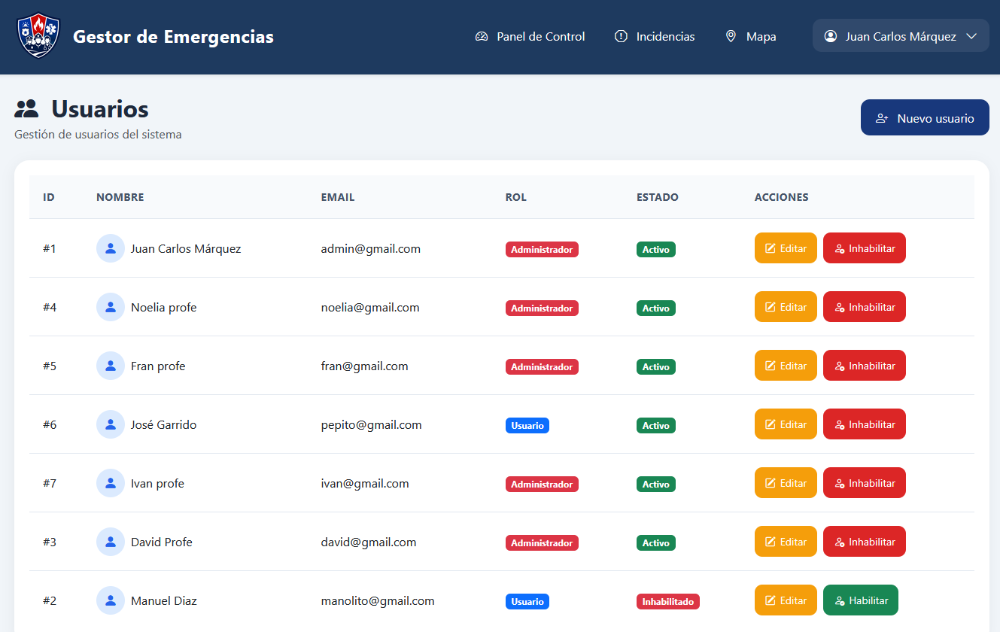
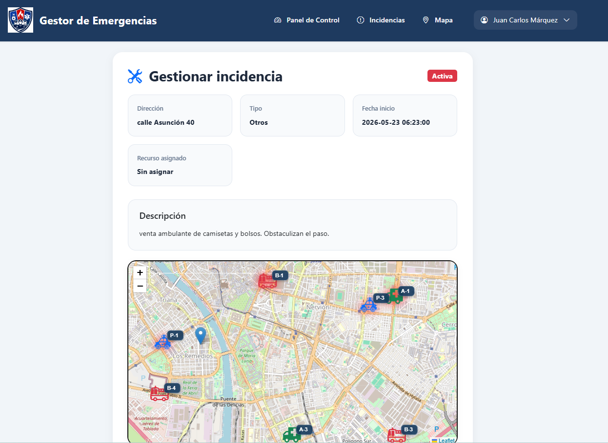

# 🚨 Emergency Manager

Aplicación web desarrollada con Flask para la gestión integral de emergencias, incidencias y recursos operativos en tiempo real.

---

# 📌 Descripción

Emergency Manager es una plataforma orientada a la coordinación de emergencias y servicios operativos, permitiendo gestionar incidencias, recursos y usuarios mediante un entorno visual moderno y un mapa interactivo.

La aplicación simula un centro de coordinación de emergencias donde policía, bomberos y servicios sanitarios pueden gestionar actuaciones operativas sobre el terreno.

Este proyecto ha sido desarrollado como Trabajo Fin de Grado (TFG) del ciclo Desarrollo de Aplicaciones Web (DAW).

---

# 🚀 Funcionalidades principales

## 👤 Gestión de usuarios

* Inicio y cierre de sesión
* Roles de usuario y administrador
* Gestión completa de usuarios
* Contraseñas cifradas mediante PBKDF2
* Validación de contraseña actual para cambios personales
* Protección contra eliminación del último administrador
* Protección contra autoeliminación

---

## 🚨 Gestión de incidencias

* Crear incidencias
* Gestionar incidencias activas
* Finalizar incidencias
* Historial de incidencias
* Resoluciones operativas
* Filtros por estado y tipo
* Clasificación por tipología:

  * Incendio
  * Incidencia de tráfico
  * Seguridad ciudadana
  * Asistencia sanitaria
  * Siniestro vial
  * Otros

---

## 🚓 Gestión de recursos operativos

* Recursos policiales (P)
* Recursos sanitarios (A)
* Recursos de bomberos (B)
* Estado libre / ocupado
* Asignación automática
* Liberación automática al finalizar incidencias
* Visualización en mapa operativo

---

## 🧠 Sistema inteligente de sugerencias

La aplicación incorpora un sistema automático de sugerencia de recursos basado en:

* Tipo de incidencia
* Distancia geográfica
* Recursos disponibles
* Prioridad operativa

### Ejemplos:

| Tipo incidencia      | Recurso sugerido              |
| -------------------- | ----------------------------- |
| Incendio             | Bomberos más cercanos         |
| Asistencia sanitaria | Ambulancia más cercana        |
| Siniestro vial       | Ambulancia + apoyo policial   |
| Seguridad ciudadana  | Patrulla policial más cercana |

---

## 🗺️ Mapa interactivo operativo

Integración completa con:

* Leaflet
* OpenStreetMap

### Funcionalidades:

* Geolocalización de incidencias
* Visualización de recursos operativos
* Iconos personalizados
* Estado visual de recursos ocupados
* Gestión desde mapa
* Vista responsive para dispositivos móviles

---

# 📱 Diseño responsive

La aplicación ha sido adaptada para:

* Ordenadores
* Tablets
* Dispositivos móviles

Incluyendo:

* Navbar responsive
* Formularios adaptativos
* Scroll horizontal inteligente en tablas
* Optimización visual móvil

---

# 🔐 Seguridad

* Contraseñas cifradas mediante PBKDF2
* Protección de rutas mediante Flask-Login
* Control de acceso por roles
* Validaciones backend
* Restricción de modificación de email
* Validación de contraseña actual
* Protección contra accesos no autorizados

---

# 🛠️ Tecnologías utilizadas

## Backend

* Python
* Flask
* SQLAlchemy
* Flask-Login
* Gunicorn

## Base de datos

* MySQL (desarrollo)
* PostgreSQL (producción)

## Frontend

* HTML5
* CSS3
* JavaScript
* Bootstrap 5
* Bootstrap Icons

## Mapas y geolocalización

* Leaflet
* OpenStreetMap

---

# 📷 Capturas

## 🔹 Panel de control



---

## 🔹 Incidencias



---

## 🔹 Mapa operativo



---

## 🔹 Gestión de usuarios



---

## 🔹 Gestión de incidencia



---

# ⚙️ Requisitos

- Python 3.x
- MySQL Server

---


# ⚙️ Instalación local

## 1️⃣ Clonar repositorio

```bash
git clone https://github.com/JUANKAMARQUEZ/emergency_manager.git
```

---

## 2️⃣ Acceder al proyecto

```bash
cd emergency_manager
```

---

## 3️⃣ Crear entorno virtual

```bash
python -m venv venv
```

---

## 4️⃣ Activar entorno virtual

### Windows

```bash
venv\Scripts\activate
```

### Linux / Mac

```bash
source venv/bin/activate
```

---

## 5️⃣ Instalar dependencias

```bash
pip install -r requirements.txt
```

---

## 6️⃣ Ejecutar aplicación

```bash
python run.py
```

---

# 🌐 Despliegue

La aplicación está preparada para despliegue en:

* Render
* PostgreSQL
* Gunicorn

---

# 🚀 Futuras mejoras

* Sistema de notificaciones en tiempo real
* Integración con correo electrónico
* Geolocalización GPS en tiempo real
* Chat operativo interno
* Panel estadístico avanzado
* Sistema de prioridades automáticas
* Gestión documental de incidencias
* Subida de imágenes adjuntas

---

# 👨‍💻 Autor

Juan Carlos Márquez Romero  

Proyecto desarrollado como Trabajo Fin de Grado (TFG)

Ciclo Desarrollo de Aplicaciones Web (DAW).

I.E.S. Punta del Verde (Sevilla)

Curso 2025/2026
